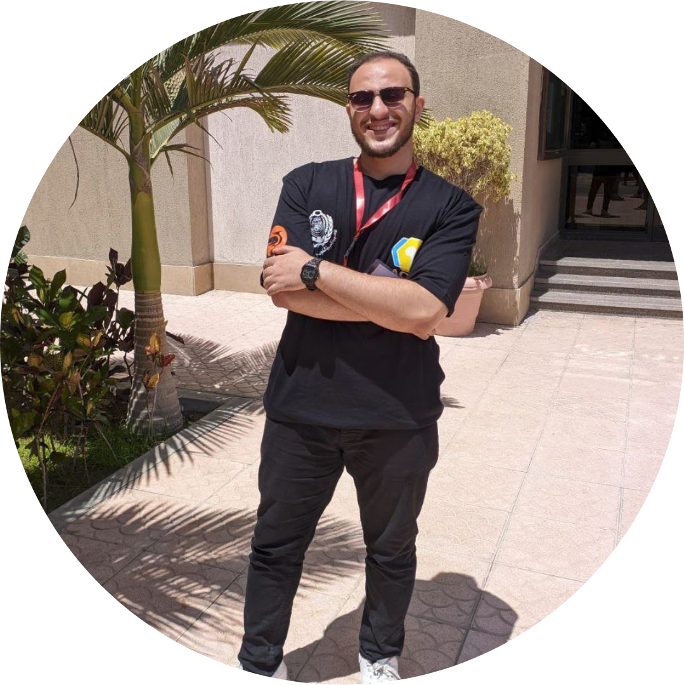

# Abdelaziz Ali Al-Araby - Personal Portfolio 🚀

 <!-- Update this with an actual screenshot if available -->

Welcome to the repository of my personal portfolio website! This project serves as a digital resume, showcasing my skills, experience, and the software I've built. As a passionate Flutter Developer and aspiring Fullstack Engineer, I designed this space to reflect my technical journey — from building cross-platform mobile apps to diving into .NET backends and exploring the frontier of Agentic AI.

🌐 **Live Demo:** [https://abdelaziz2004264.github.io/](https://abdelaziz2004264.github.io/)

## ✨ Key Features

- **Modern & Premium UI**: Deep navy dark mode with purple-teal gradients and sleek glassmorphism elements.
- **Interactive Animations**: Smooth scroll reveals on every section, animated floating elements, and dynamic particle backgrounds.
- **Responsive Layout**: Designed mobile-first to ensure a flawless experience across all devices, complete with an off-canvas mobile menu.
- **Filterable Project Gallery**: Organizes projects by category (All, Flutter, Backend, Web, C++/Python) allowing visitors to easily find relevant work.
- **Dynamic Content Showcase**: Features an interactive experience timeline and a certificate gallery with zoom-in modal functionality.

## 🛠️ Technology Stack

This portfolio is built entirely with lightweight, performant core web technologies:

- **Structure**: Semantic HTML5
- **Styling**: Vanilla CSS3 (Custom Properties, Flexbox, Grid, CSS Animations)
- **Interactivity**: Vanilla JavaScript (ES6+)

### Third-Party Libraries

- **[Typed.js](https://mattboldt.com/demos/typed-js/)**: For the dynamic typing effect in the hero section.
- **[ScrollReveal.js](https://scrollrevealjs.org/)**: To trigger beautiful entry animations as elements enter the viewport.
- **[Boxicons](https://boxicons.com/)**: For the crisp, lightweight iconography used throughout.

## 🚀 Structure

- `index.html`: The core structure and content of the single-page application.
- `css/styles.css`: All styling rules, animations, and responsive media queries.
- `js/script.js`: Handles all interactions: sticky header, mobile navigation, scroll spy, project filtering logic, and library initialization.
- `images/`: Directory containing all assets (profile pictures, project screenshots, certificates).

## 🧑‍💻 About Me

I am currently a student at Cairo University (FCAI-CU) and actively participating in the Digital Egypt Pioneers Initiative (DEPI) Full Stack Development Track. My technical focuses include:

- **Mobile**: Flutter, Dart, Riverpod, Bloc/Cubit
- **Backend/Fullstack**: .NET, C#, FastAPI, Spring Boot, SQL/NoSQL
- **AI Tooling**: LangChain, LangGraph, MCP, RAG

If you'd like to collaborate on a project or connect regarding opportunities, feel free to reach out via [LinkedIn](https://www.linkedin.com/in/abdelaziz-ali-al-arabi-94ab67292/) or [Email](mailto:abdelaziz2004264@gmail.com).

---
*Crafted with 🩵 by Abdelaziz Ali*
